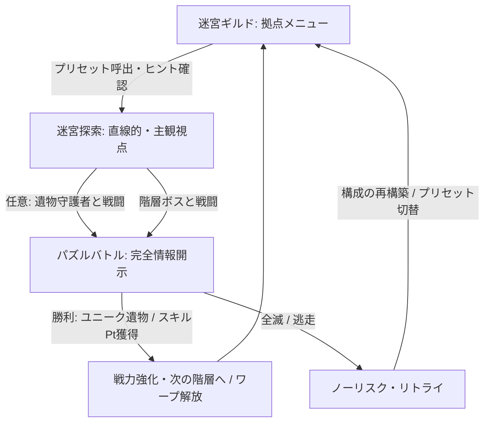

# Relicspire (レリクスパイア)

タイムラインバトルと自由なリビルドで強敵に挑む思考型ダンジョン RPG です。
3人パーティと8職のスキルツリー、固定性能の遺物を組み合わせ、パズルのように神の試練を攻略します。

## 1. 基本情報

- **ジャンル**：思考型ダンジョンRPG（主観視点探索 × タイムライン・アクティブバトル）
- **プレイ人数**：1人
- **コンセプト**：**「無駄な戦闘を排し、神の試練に『人の知恵』で挑む、超濃縮・詰み将棋RPG」**
- **ターゲット層**：試行錯誤やビルド構築、詰将棋・パズル的な戦略バトルを好むプレイヤー

---

## 2. コア体験と特徴

- **雑魚戦完全排除 × 全10階層のハイテンポ・ボスバトル特化設計**
  - ランダムエンカウントや作業的な雑魚戦を完全排除。
  - 各階層には「階層ボス（1体）」と「遺物を守護する強敵（約5体）」のみを配置。
  - 遺物集めは任意であり、守護者を無視して階層ボスへ直行することも可能。
- **完全情報開示型のタイムライン・アクティブバトル**
  - 左から右へアイコンが流れる一本のバー形式タイムラインを採用。
  - 敵の「次の使用スキル（物理・魔法・チャージ技等）」を完全事前予告。
  - 敵の残りHPもゲージで把握可能。100%の事前情報をもとに対策手を組み立てる詰将棋体験。
- **完全リソースレス制（ディレイ＆クールダウン管理）**
  - MPやSPを撤廃。
  - スキルの制約はタイムライン上の「硬直（ディレイ）」および「クールダウン（再使用時間）」のみ。
- **自由度100%の「6スロット装備システム」**
  - 部位制限のない6つの自由装備枠。
  - 初期装備品は3名に同一品が配布され、受け渡しによる同一装備の集中運用（例：革の鎧×3積み）も可能。
  - 迷宮内で手に入る「遺物」はすべて固定性能かつユニーク（1点物）。
- **完全フラットな3人パーティ × 同一職重複可能な8ジョブ**
  - キャラクター3名の基礎スペックは完全同一。
  - 初期全開放の8ジョブから自由に編成でき、「ウィザード3人」等の極端な重複編成も可能。
  - レベル上げ作業はなく、強さは「スキルポイント総数」と「装備品」のみに依存。
- **スマートなコマンドUI（上位スキル自動置換）**
  - 習得したスキルはすべてバトルコマンドとして使用可能。
  - 同系統スキル（例：「ヒールLv1」と「ヒールLv2」）は上位版へ自動置換され、コマンドの肥大化を防止。
- **ノーリスク・リビルド ＆ プリセット保存機能**
  - 戦闘外でのジョブ・スキル・装備の振り直しは完全無料。
  - 戦闘中の逃走・やり直しもノーペナルティ。
  - 頻繁なビルド変更を快適にする「構成プリセット保存・呼出機能」を完備。
- **シビアな戦闘不能・蘇生ルール**
  - 戦闘中の蘇生は、クレリックの上位スキル（他者蘇生）またはバーサーカーの上位スキル（自己蘇生）に限定。専用スキルがない限り戦闘中の復帰は不可能。
- **バフ・デバフの仕様**
  - 同系統のバフやデバフの重ねがけは効果時間の上書きのみ。

---

## 3. ゲームサイクル

1. **【迷宮ギルド（拠点）】**
   - プリセット呼出やスキル・6枠装備の調整を行い、伝言板でボスの傾向を確認して出撃。クリア済み階層へのワープも可能。
2. **【迷宮探索（全10階層・主観視点）】**
   - 直線的・コンパクトな主観視点迷宮を前進。
   - 「遺物を守る強敵（各階約5体）」を倒してユニーク装備を回収するか、無視して「階層ボス」へ直行するかを選択。一度倒したボス・守護者は再出現しない。
3. **【タイムライン・アクティブバトル】**
   - 予告行動アイコンを見極め、「詠唱妨害」「ブレイク」「ディレイ管理」で敵を行動不能に追い込む。
4. **【敗北・リビルド】**
   - 敗北してもペナルティなし。相手の行動パターンに合わせてジョブ（重複可）・スキル・6枠装備を再構築して再挑戦。

---

## 4. バトルシステム詳細

- **① タイムラインゲージ（一本バー形式）**
  - 左から右へアイコンが流れて端に到達すると行動。
- **② 詠唱（チャージ）とノックバック（行動遅延）**
  - 敵の大技チャージ中に特定攻撃を当てて詠唱を遅延・キャンセル。
- **③ 弱点・ゲージ破壊によるブレイク（行動スキップ）**
  - 弱点攻撃やブレイク削りにより、敵を行動不能（スタン）状態にしてタイムライン最後尾へ後退させる。
- **④ ディレイ＆クールダウン管理**
  - 手数重視の短ディレイ技と、大ダメージだが硬直・クールダウンの長い重技を状況に応じて選択。
- **⑤ 蘇生制限**
  - クレリックの他者蘇生スキル、バーサーカーの自己蘇生スキルのみが唯一の復帰手段。

---

## 5. 厳選8ジョブ一覧と育成ルート

| ジョブ名         | ルートA（特化方針）          | ルートB（特化方針）            | 特徴・キー固有スキル                                       |
| ---------------- | ---------------------------- | ------------------------------ | ---------------------------------------------------------- |
| **ナイト**       | 鉄壁の守護者（物理盾）       | 聖なる対魔師（魔法盾）         | 挑発・防御・反射により味方を守る前衛要塞                   |
| **ウィザード**   | 大魔導（一撃必殺型）         | 属性術士（高速ブレイク型）     | 長詠唱の高火力技や弱点属性による削りを担う主砲             |
| **クレリック**   | 救世主（純ヒーラー）         | 導き手（バッファー）           | HP回復・速度バフに加え、**上位スキルで味方蘇生が可能**     |
| **シーフ**       | 影の暗殺者（高速アタッカー） | サボタージュ（妨害特化）       | 短ディレイ技の連続行動や敵の速度奪取                       |
| **レンジャー**   | スナイパー（詠唱キラー）     | トラッパー（状態異常・遅延型） | 敵の詠唱妨害や設置罠による足止め                           |
| **バーサーカー** | 不屈の闘士（背水型）         | デモリッシャー（ブレイク特化） | 背水火力・ゲージ粉砕に加え、**上位スキルで自己蘇生が可能** |
| **時魔道士**     | 時間加速者（味方強化）       | 時間停滞者（敵弱体）           | 味方のタイムライン前進や敵の完全時間停止                   |
| **パラディン**   | ジャッジメント（攻防一体型） | コマンダー（連携・指揮型）     | 被攻撃時の即時反撃や味方行動への追撃                       |

---

## 6. 画面・UI構成案（拠点メニュー）

- **背景アート**：石造りの重厚なカウンター、魔導ランプ、壁の迷宮地図、受付職員の2Dイラスト。
- **機能メニュー**：
  1. **【迷宮に入る】**：攻略中の階層（全10階層）への移動およびクリア済み階層へのワープ。
  2. **【ジョブ・スキル再構築】**：3人のジョブ（重複選択可）およびスキルポイント割り振り。
  3. **【宝物庫（遺物装備）】**：初期装備・ユニーク遺物を6スロットの自由装備枠に着脱・管理。
  4. **【ビルド・プリセット】**：現在のパーティ構成（ジョブ・スキル・装備）の保存・呼出。
  5. **【ギルドの伝言板】**：次のボスの傾向や行動パターンのヒント閲覧。
