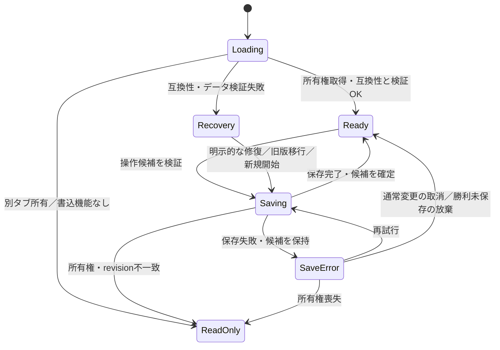

# 1.5 Relicspire 保存・復旧・画面遷移

本書は [開発タスク](./tasks.md) の1.5に対応する。戦闘ルール9節、育成仕様4～5節、階層仕様1・5節の保存境界を具体化する。実装はタスク4・5で行い、仕様確定と実装完了を区別する。画面・設定・更新通知の詳細は [表示・配信・MVP仕様](./display-delivery-mvp.md) に従う。

## 1. セーブの単位と対象

### 1.1 永続データ

ゲーム進行のセーブはブラウザの同一オリジンにつき1スロット。idb-keyvalによるIndexedDB保存を用い、キーは `relicspire-save` とする。設定も同じ保存単位に含める。

| 区分 | 保存内容 | 正規データ／導出 |
| --- | --- | --- |
| 識別 | saveId、schemaVersion、contentVersion、revision、更新日時 | 正規。初版の両versionは1、revisionは初回1から整数で増加 |
| 編成 | party-1～3のジョブ、習得ノード、6枠 | 正規。育成仕様4節で検証 |
| プリセット | 最大20件のID・名称・編成・版・日時 | 正規。無効な旧プリセットも保持 |
| 進行 | 全60敵IDの討伐済み集合 | 正規。同じIDは1回だけ |
| 所持品 | 初期品各3、討伐済み守護者の遺物各1 | 討伐済みから導出。個別の所持数を正規データとして保存しない |
| ポイント | 3＋boss-01～09の討伐数、使用／未使用ポイント | 討伐済みと編成から導出 |
| 階層 | floor-01と討伐済みボスによる解放 | 討伐済みから導出 |
| クリア | boss-10討伐による最終クリア | 討伐済みから導出 |
| 探索復帰先 | guild、またはfloorId＋nodeId | 正規。通常時の現在位置／戦闘時の遭遇前位置 |
| 演出管理 | 初訪問済み階層集合、endingHandled | 正規。endingHandledは最後まで閲覧またはスキップ／拠点選択を確定したこと |
| 設定 | 音量・演出等の設定値 | 正規。項目・既定値は表示・配信・MVP仕様3節で定義 |

HPは戦闘外では最大HPとして導出する。戦闘時刻、敵HP、状態、CD、罠、選択中コマンド、戦闘ログ、敗北画面、入力途中の編集、エンディングのページ番号は保存しない。戦闘開始前スナップショットはメモリに保持し、その正規データ部分を開始前に永続保存する。

初訪問済みは入口文の初回表示を決めるだけで攻略条件にしない。endingHandledがfalseで最終クリア済みなら起動時に「エンディングを見る／拠点へ」を表示する。

### 1.2 原子的な保存

- キー内の保存包は `current`（最新確定スナップショット）と `previous`（直前確定スナップショット、初回はnull）を保持する。通常更新では現在値をpreviousへ移し、新しいcurrentと同じ1回のIndexedDB更新で確定する。
- 非同期書き込みは全経路で1つの保存管理器へ直列化する。Zustand persistはこの管理器を通し、個々のStoreや画面から同じキーを別々に上書きしない。
- 保存時は最新saveIdとrevisionを再確認し、期待値と一致し、表示・配信・MVP仕様の配信状態キーが実行中buildIdと一致する場合だけrevision+1で更新する。この確認と更新は同じIndexedDBトランザクション内で行う。取得後の単純なsetで代用しない。
- 保存成功はトランザクション完了で判断する。成功前の候補は「未確定」とし、ゲーム進行を許可しない。保存完了を待つUIを表示する。
- 成否不明のエラーではキーを読み直し、候補saveId・revisionと内容が一致すれば保存済みとして扱う。違えば旧確定値を維持して再試行する。報酬再試行は同じ候補を保存し、もう一度加算しない。
- 初回の空スロットは期待値を「キー不存在」とする。破損でsaveId・revisionを読めない復旧では、読み出した保存包全体の一致をトランザクション内で照合してから置換する。新規開始・previous復元も置換前の期待値を照合し、別タブの更新を消さない。新saveIdで開始するときだけrevisionを1へ戻し、それ以外の更新・復元は現在revisionから増やす。破損でrevision不明の場合は新saveId・revision1として復旧する。
- 更新日時は表示用であり、新旧判定や競合解決にはrevisionを使う。ID・版・revisionを含む形式と移行コードはタスク4で型定義する。

## 2. 保存時点と通常エラー

| 操作 | 保存する候補 | 成功後の画面・操作 |
| --- | --- | --- |
| 新規開始 | 初期編成・18初期品の導出元・初期進行・guild | 拠点 |
| 移動、ワープ、帰還 | 新しい復帰先、必要なら初訪問済み | 移動先。入口文は保存成功後に初回表示 |
| ジョブ・スキル・装備編集確定 | 検証済みの全編成 | 編集結果を確定、変更後HP全快 |
| プリセット保存・上書き・改名・削除・呼出 | 検証済み候補 | 一覧または更新済み編成 |
| 戦闘開始 | 最新編成と遭遇前の親分岐を持つ正規データ | 保存成功後だけ時刻0から開始 |
| 敗北・逃走 | 原則保存不要。開始前確定状態を維持 | 敗北画面／親分岐。再読み込みは親分岐 |
| 勝利 | 3節の勝利候補 | 保存成功後だけ勝利結果の次操作を許可 |
| 設定確定 | 現在の確定進行と新設定 | 設定確定。戦闘状態は含めない |
| エンディング完了・スキップ・拠点選択 | endingHandled=true、復帰先guild | 拠点 |

生存敵の部屋を選択するときは親分岐を復帰先にしたまま遭遇確認を表示する。「回避」は親分岐へ戻り追加保存不要。討伐済みの部屋へ入るときはその部屋を通常の復帰先として保存する。

一般の保存失敗では候補をメモリに保持し「再試行／変更を取り消す」を表示する。取り消しは最後の確定状態へ戻す。戦闘開始前なら開始せず遭遇確認へ戻す。設定変更失敗は設定だけを元に戻し、戦闘を破棄しない。保存待ち中の重複操作を受け付けない。

戦闘中の設定保存は最後の確定進行だけを使う。勝利候補の保存待ち中は設定保存も拒否し、候補を旧進行で上書きしない。敗北・リトライで現在設定を開始前の古い値へ戻さない。復元対象は戦闘に使う編成・進行・遭遇前位置であり、設定は現在の確定値を保持する。

IndexedDB無効・初回保存不能では進行開始を許可しない。タイトルに原因と再試行を表示し、無保存モードは設けない。既存セーブを読むことができても保存不能なら読取専用状態へ切り替える。容量不足でもセーブを自動削除せず、最後の確定セーブを保持する。

### 保存状態の遷移

ReadOnly・Recoveryでは編成・進行を変更しない。ReadOnlyからは3・4節の規則で読み直しと所有権取得、Recoveryからは5節の選択を通して復帰する。

## 3. 勝利確定と保存失敗

全ボス・全守護者に同じ処理を適用する。

1. 戦闘ロジックで勝利を確定し、イベントを破棄する。ここでは「勝利・保存中」と表示する。
2. 開始前の確定進行へ敵IDを1つ追加した候補を作る。遺物・予算・解放・クリアはこの集合から導出し、復帰先は討伐した敵の部屋にする。最終ボスのみ復帰先guild、endingHandled=false。
3. 所有権とrevisionを検証して候補を保存する。保存完了後、結果画面で遺物・ポイントを「獲得済み」と表示する。
4. 次操作（帰還・探索続行・次階層・エンディング）は保存完了後だけ有効にする。

保存失敗時は「再試行／未保存の勝利を放棄して遭遇前へ」を表示する。放棄は未取得報酬と討伐を破棄することを明記して確定を求め、直前の確定セーブと遭遇前状態へ戻る。勝利後の戦闘リトライとしては扱わず、未保存だった遭遇を新しく開始できる。放棄前に保存内容を再確認し、候補が実際には確定済みなら放棄せず保存済みの結果を表示する。

候補がメモリにしかない間のリロード・ブラウザ終了・クラッシュでは、未保存の勝利は保持を保証しない。再起動ではIndexedDBの確定値を読み、保存済みなら敵非再出現、未保存なら遭遇前からやり直す。アプリ内の戻る操作は進行を止めて上記選択を表示する。終了時の自動保存には依存しない。

## 4. 複数タブ・ウィンドウ

- 同一オリジンの進行はWeb Locksによる排他的な所有権（名前 `relicspire-save-owner`）を保持する1タブだけが変更できる。所有権は保存・戦闘・移行・新規開始の全期間に適用する。
- 別タブは読取専用の拠点・進行閲覧画面とし、「別のタブでプレイ中／再確認」を表示する。戦闘・編成・設定保存・プリセット操作・移行・新規開始は許可しない。
- 自動の所有権横取りはしない。所有タブの終了後に「再確認」で取得し、必ず最新セーブを読み直してから操作可能にする。以前のメモリ状態を持ち越さない。
- Web Locksが利用不能なら書き込みとプレイ開始を許可せず、対応ブラウザでの利用を案内する。読めるセーブがあれば閲覧可能。互換ブラウザと案内文は基盤・UI検証で確認する。
- 非表示だけでは所有権を手放さない。所有権喪失・revision不一致を検出したタブは戦闘と書き込みを停止して読取専用へ移る。古い戦闘の勝利候補を新しいセーブへマージしない。
- 通知は他タブへ「保存更新」を知らせる補助であり、通知の有無で正しさを判断しない。正しさは所有権と保存トランザクション内のrevision照合で保証する。

## 5. 版・検証・復旧

### 5.1 読み込み順

所有権確認→保存包の構造確認→currentの版確認→対応する移行→進行・編成・プリセット検証→復帰先の判定の順で行う。移行は候補に対して行い、失敗時にcurrentを上書きしない。previousの版・構造・整合性も同じ規則で検証し、future版のpreviousは復元しない。対応済み旧版は変更概要を表示し、移行保存成功後にプレイ可能にする。

| 状況 | 処理 |
| --- | --- |
| 対応済み旧schema／content版 | 定義済み移行を実行。previousに元データを残して一括確定 |
| どちらかがアプリより未来版 | 保存・移行・過去版への巻き戻しを拒否。新版アプリでの起動を案内 |
| 古い版だが移行コードがない | 自動解釈をしない。復旧画面で元データ保持・書き出し・新規開始を選択 |
| current破損、previousが互換・有効 | 巻き戻る進行の差分を表示して復元の確定を求める |
| current／previousとも無効 | 元データ書き出しと新規開始を案内。自動初期化しない |
| 旧プリセットだけ無効 | 進行ロードを止めず保持・無効表示。育成仕様5.2節で呼出時修復 |

未来版は破損扱いせず、previousへ自動復元しない。対応表のない削除済み敵IDも正常データとして無視せず、復旧対象として表示する。

### 5.2 進行と現在編成の修復

| 不整合 | 修復候補と説明 |
| --- | --- |
| 討伐IDの重複 | 集合へ正規化。報酬を追加加算しない |
| ID変更 | content移行の明示的対応表で変換。対応なしは停止 |
| ボス順序の穴、未解放階層の守護者討伐 | 勝手に討伐・報酬を追加せず停止。previous復元か新規開始を案内 |
| 古い保存値の所持数・予算・解放・クリアが討伐と不一致 | 討伐集合を正規として導出し直し、差分を提示 |
| 現在編成の未知ジョブ | 初期編成への戻しを提示。進行・プリセットは保持 |
| 未知／他職スキル、前提欠落 | 該当ノードと依存子孫を解除 |
| 予算超過 | その人物の習得を全解除し全額未使用へ。恣意的なノード選別をしない |
| 未取得・削除済み装備、過剰装備 | 育成仕様5.2節と同じ人物・枠順で空欄化 |
| 不正な復帰先・初訪問ID | 復帰先guild、不正訪問ID除去。進行条件の穴は別途拒否 |
| クリア前なのにendingHandled=true | falseへ戻す。クリア自体はboss-10討伐から導出 |
| 不正な設定値 | 該当項目だけ1.6の既定値へ戻す |

修復は候補の差分を表示してプレイヤーの確定後に保存する。初期編成へ戻す場合は3人の初期ジョブ・A1/A2を適用し、所持品の現在値で初期装備を配布し直さず各1個を装備する。余った予算は未使用。

previousから復元する場合も現在セーブと修復前データを黙って消さない。復旧画面はcurrent／previousの生データを1つのJSONファイルに書き出せる。修復・移行の保存ではpreviousへ修復前currentを保持する。previous復元ではpreviousの検証済み内容を新currentにし、旧currentをpreviousへ残す。正常保存を進めるとpreviousは直前世代へ置換されるため、長期の復旧保管は書き出しで行う。JSONの任意インポート機能は今回設けない。

新規開始は上書きされる進行・プリセットを明記して確認する。成功時は新saveId、初期進行、初期編成、プリセット0件、訪問0件、endingHandled=false、復帰先guild。現在の有効な設定のみ引き継ぎ、設定リセットは別操作とする。新規開始の包も旧currentをpreviousへ残すが、UIからの復元は進行が巻き戻ることを表示して確定を求める。失敗なら旧セーブのまま。

## 6. 画面遷移・起動時の再開

| 現在画面・操作 | 次画面／確定内容 | 再読み込み時 |
| --- | --- | --- |
| 起動、通常セーブ | 保存したguild／探索ノード | 同じ復帰先 |
| 探索→生存敵を選ぶ | 遭遇確認、復帰先は親分岐 | 親分岐、戦闘未開始 |
| 遭遇確認→戦う | 戦闘前保存→戦闘 | 親分岐、戦闘状態なし |
| 戦闘→戻る | 論理処理・演出を一時停止、逃走／同編成リトライ／続行を選ぶ | 親分岐 |
| 戦闘→逃走 | 処理単位末尾で確定、親分岐へ | 親分岐 |
| 戦闘→敗北 | 敗北画面、同編成リトライ／遭遇前／拠点を選ぶ | 親分岐 |
| 戦闘・敗北→同編成リトライ | 開始前編成を使用して時刻0から開始 | 親分岐 |
| 敗北→拠点、再編成、再挑戦 | 編集保存→ワープ・遭遇確認→新しい戦闘前保存 | 新しい確定復帰先 |
| 勝利→保存成功 | 勝利結果。敵非再出現、部屋が復帰先 | 討伐済み部屋。報酬再付与なし |
| 勝利結果→拠点／次階層 | 移動候補を保存→移動先 | 保存できた移動先 |
| 最終勝利→保存成功 | エンディング開始 | guildと未処理エンディングの選択 |
| エンディング完了／スキップ | endingHandled保存→拠点 | 拠点。自動エンディングなし |
| クリア後→エンディング再閲覧 | 演出だけを開始 | 既存の復帰先、報酬・フラグ不変 |
| 保存／移行／修復待ち→戻る | 操作を止め、結果確定まで別画面へ遷移しない | 実際に確定しているセーブ |

アプリ内の戻る・キーボードの戻る・ブラウザ履歴移動は共通の遷移管理を通す。ブラウザ自体の終了や強制リロードは防止を保証せず、復帰は保存済みデータだけから行う。逃走・リトライ要求時に同じ処理単位で勝利が成立した場合は勝利を優先する。

同編成リトライでは戦闘前確定状態が変わらないため再保存不要。ただし最新revisionの所有権確認は行い、競合なら開始しない。設定の確定保存でrevisionが変わった場合は自タブの開始前状態の設定・revisionを更新し、編成・進行は変えない。

## 7. 受け入れ例と後続タスク

| ID | 条件 | 期待結果 |
| --- | --- | --- |
| S01 | 戦闘前保存に失敗 | 時刻0の戦闘を開始しない。旧確定状態を保持 |
| S02 | 遭遇確認・戦闘・敗北でリロード | 親分岐へ復帰、敵は未討伐、HP全快 |
| S03 | boss-01勝利保存を同じ候補で再試行 | 予算4、floor-02解放。追加で5にならない |
| S04 | 守護者勝利保存後・結果の次操作前に終了 | 遺物1個・討伐済み、討伐部屋に復帰 |
| S05 | 勝利保存失敗後に再起動 | 未保存なら遭遇前、実際に確定済みなら討伐済み。両方を付与しない |
| S06 | 別タブで同時に起動 | 片方だけ所有、他方は読取専用。古い戦闘結果で上書き不可 |
| S07 | 未来content版のセーブを旧アプリで開く | 書き込み拒否、巻き戻しや自動初期化なし |
| S08 | 現編成が予算超過、旧プリセットも予算超過 | 現編成は確認付き全解除候補、プリセットは保持・呼出拒否 |
| S09 | 最終勝利保存後、エンディング途中で終了 | クリア済み、起動で見る／拠点へ。報酬再付与なし |
| S10 | スキップの保存失敗 | endingHandledは未確定、再試行または取消で未処理のエンディング選択へ戻る。保存済み復帰先は変更しない |
| S11 | 新規開始の保存失敗 | 旧進行・プリセット・設定・saveIdは不変 |
| S12 | 処理中に設定を保存してから同編成リトライ | 編成は戦闘前、設定は最新確定値。設定を過去値へ戻さない |

1.5の5項目は1～2節（保存境界）、3節（勝利失敗）、4節（複数タブ）、5節（版・復旧）、6節（遷移）で定義した。S01～S12はタスク4・5の実装テストとして固定する。設定既定値・PWA更新契機は表示・配信・MVP仕様3・6節で確定済み。配信状態キーはゲーム進行の復旧対象とは分離する。
